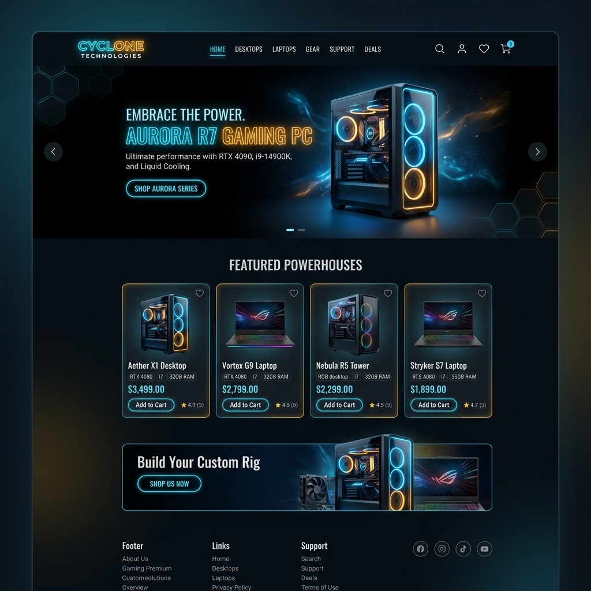

# ⚡ Cyclone Technologies — High Performance E-Commerce Platform

[](https://laravel.com)
[](https://php.net)
[](https://getbootstrap.com)
[](https://supabase.com)
[](https://vercel.com)

A modern, full-featured, **100% Mobile Responsive** e-commerce application built for selling gaming PCs, laptops, and tech peripherals. Powered by **Laravel 10**, custom glassmorphism design system, real-time messaging, and ready for deployment on **Vercel** & **Supabase**.

---

## 🌟 Key Features

### 📱 100% Mobile Responsive Architecture
- Dynamic slide-out mobile drawer menu with touch navigation.
- Responsive product grids, shop filters, account dashboard, and cart tables.
- Fluid media scaling across all mobile devices, tablets, and desktop resolutions.

### 🛒 E-Commerce & Customer Capabilities
- **Product Shop & Filtering**: Browse by categories, search products, view specs, and filter items.
- **Cart & Checkout**: Interactive cart management, order summaries, and coupon discounts.
- **Multiple Payment Methods**: Support for Stripe API payments and Cash on Delivery (COD).
- **Order Tracking**: Real-time order tracking ID system with status updates (`Processing`, `Packaging`, `Shipped`, `On the way`, `Delivered`).
- **Customer Rewards System**: Earn and claim reward points on purchases.

### 💬 Real-Time Buyer-Seller Chat
- Integrated direct messaging interface between buyers and sellers with unread notification badges.

### 📊 Admin Control Center
- **Analytics Dashboard**: Interactive Chart.js data visualizations (Revenue, Total Customers, Product Sales, Active Orders).
- **Inventory & Category Management**: Add, edit, delete products with multi-image/video support.
- **Customer & Order Management**: View customer profiles, update delivery/payment statuses, and print invoices/bills.

---

## 📸 Application Screenshots

### 💻 User Frontend Overview


### 📊 Admin Dashboard & Analytics


---

## 🧰 Tech Stack

- **Backend Framework**: Laravel 10.x
- **Language**: PHP 8.2+
- **Frontend UI**: Blade Templating, HTML5, Custom CSS3 Design System, Bootstrap 5
- **Database**: MySQL / PostgreSQL (Supabase Compatible)
- **Charts & Animations**: Chart.js, SweetAlert, Slick Carousel
- **Cloud Infrastructure**: Vercel Serverless PHP, Supabase Cloud PostgreSQL

---

## 🚀 Quick Setup & Installation

### Prerequisites
- PHP >= 8.1
- Composer
- MySQL or PostgreSQL Database

### Installation Steps

1. **Clone the Repository**
   ```bash
   git clone https://github.com/geeth20001223/cyclone_technologies.git
   cd cyclone_technologies
   ```

2. **Install Composer Dependencies**
   ```bash
   composer install
   ```

3. **Configure Environment Variables**
   ```bash
   cp .env.example .env
   php artisan key:generate
   ```

4. **Set Up Database in `.env`**
   ```env
   DB_CONNECTION=mysql
   DB_HOST=127.0.0.1
   DB_PORT=3306
   DB_DATABASE=ecommerce
   DB_USERNAME=root
   DB_PASSWORD=
   ```

5. **Run Migrations & Seeders**
   ```bash
   php artisan migrate
   ```

6. **Start Local Server**
   ```bash
   php artisan serve
   ```
   Open your browser at `http://127.0.0.1:8000`.

---

## ☁️ Deployment

### 🔴 Render.com (Recommended Containerized Deployment)

This repository is pre-configured with a production-ready **Docker** & **Render Blueprint (`render.yaml`)** setup:

1. **Push your repository to GitHub / GitLab**.
2. Log into [Render Dashboard](https://dashboard.render.com).
3. Click **New +** -> **Blueprint** (or **Web Service**).
4. Connect your `cyclone_technologies` repository.
5. Render will automatically detect `render.yaml` and set up the Docker web service.
6. Configure your environment variables on Render:
   - `DB_HOST`, `DB_DATABASE`, `DB_USERNAME`, `DB_PASSWORD` (Point to your MySQL or PostgreSQL database like Supabase or FreeSQLDatabase).
   - `APP_URL` (Set to your live Render app URL: `https://<your-app-name>.onrender.com`).
7. Click **Apply** or **Deploy Web Service**! 🚀

---

### ⚡ Vercel + Supabase (Serverless Deployment)

This repository also includes pre-configured deployment files for **Vercel**:
- `vercel.json` (Vercel routes & static asset handling)
- `api/index.php` (Serverless PHP entrypoint)
- `supabase_import.sql` (PostgreSQL database import script)

---

## 📜 License

This project is open-source software licensed under the MIT license.
